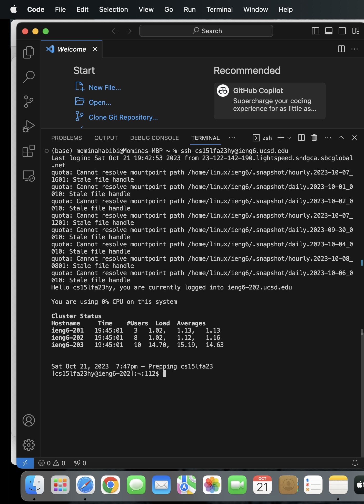

# Lab Report 2 - Servers and SSH Keys
*By Momina Habibi*

---
## **Part1**

Here is the code for the StringServer

```
import java.io.IOException;
import java.net.URI;
import java.net.URLDecoder;
import java.io.UnsupportedEncodingException;

class Handler implements URLHandler {
    // The one bit of state on the server: a number that will be manipulated by
    // various requests.
    int num = 1;
    String string = "";

  public String handleRequest(URI url){
    if(url.getPath().equals("/")){
        return string;
    }
    else{
    if(url.getPath().contains("/add-message")){
      String[] parameters = url.getQuery().split("=");
      if(parameters[0].equals("s")){
        String message = "";
        try{
           String encodedParameter = parameters[1];
           String decodedParameter = URLDecoder.decode(encodedParameter, "UTF-8");
           message = num + ". " + decodedParameter + "\n";
        }
        catch(UnsupportedEncodingException e){
            e.printStackTrace();
        }
        string += message;
        num += 1;
        return string;
      }
    }
        return "404 not Found!";
    }
  }
}


class StringServer {
    public static void main(String[] args) throws IOException {
        if(args.length == 0){
            System.out.println("Missing port number! Try any number between 1024 to 49151");
            return;
        }
        int port = Integer.parseInt(args[0]);
        Server.start(port, new Handler());
    }
}
```
## Here is the screenshot for the first message


The URL  [Link](HTTP://localhost 4000/add-message?s=Hello)

* The handleRequest(URI url) method is called, and the URLDecoder.decode(encodedParameter, "UTF-8") is called to decode the message.
* The relevant arguments and values for the handleRequest(URI url) method is url which contains the path "/add-message" and it also contains the query which is "s=Hello". The arguments and the values of the URLDecoder.decode methods are encodedParameter and the UTF-8 which is the character encoding used for decoding. The value of the decodedParameter will have "Hello".
* The values of any relevant fields of the class change: The num variable, is used to track of the message sequence number, which is incremented from 1 to 2. and the string variable, stores a running log of messages, and each new message is appended to it with the appropriate sequence number,  is updated to "1.Hello\n".


## Here is the screenshot for the second message


The URL [Link](HTTP://localhost 4000/add-message?s=How%20are%20you)

* The handleRequest(URI url) method is called, and the URLDecoder.decode(encodedParameter, "UTF-8") is called to decode the message.
*  The relevant arguments and values for the handleRequest(URI url) method is url which contains the path "/add-message" and the query string is split into an array 'parameters' where parameters[0] is "s" and parameters[1] is "How%20are%20you".The value of encodedParameter will have "How%20are%20you". The UTF-8 is used for decoding. 
* The values of any relevant fields of the class change: At the start, the num variable is initialized with 1 and the string variable is empty. After the request is valid the code proceeds, so the decodedParameter resulting with the value of "How are you" the string variable updated to "1. Hello\n 2. How are you\n" and the num variable is incremented from 2 to 3.

## **Part2**
Using the command line, show with ls and take screenshots of:

The path to the private key for your SSH key for logging into ieng6 (on your computer or on the home directory of the lab computer)



The path to the public key for your SSH key for logging into ieng6 (within your account on ieng6)


A terminal interaction where you log into ieng6 with your course-specific account without being asked for a password.


## **Part3**

